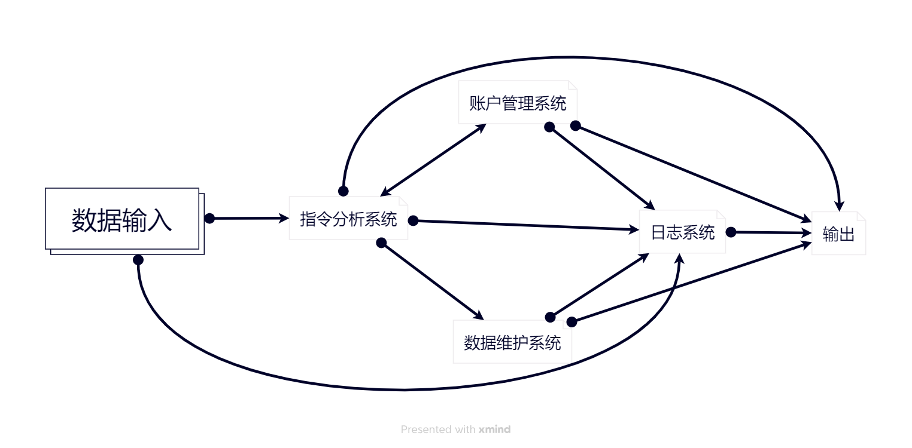

# 功能需求
实现一个书店管理系统  
## 架构设计
包含以下子系统：  
- 账户管理系统
- 数据维护系统
- 日志系统
- 指令分析系统
## 功能分析
1. 账户分类以及权限等级
   - 店长(lvl 3)
   - 店员(lvl 2)
   - 顾客(lvl 1)
   - 游客(lvl 0)

2. 需要维护的数据  
一个由许多种图书组成的数据库  
每种图书包含：
   - ISBN号（20个字符，唯一标识）
   - 书名（60个字符）
   - 作者（60个字符）
   - 关键字（60个字符）
   - 库存量（整型）
   - 单价（非负实数）

3. 支持的操作以及权限
   - 注册(lvl 0)
   - 登录(lvl 0)
   - 查询(lvl 1)
   - 购买(lvl 1)
   - 进货(lvl 2)
   - 录入 / 修改信息(lvl 2)
   - 创建用户(lvl 2)
   - 查询以下信息(lvl 3)
        - 采购信息
        - 销售情况
        - 盈亏情况
        - 员工工作报告
        - 系统工作日志
4. 记录所有操作
## 业务流程
- 账户管理系统：  
维护账户数据库  
- 数据维护系统：  
维护图书数据库
- 日志系统：  
维护书店的营业情况  
维护系统的工作情况  
- 指令分析系统：  
接收指令，分析指令合法性以及用户权限，根据结果调用相应系统的对应方法  
## 数据流

***
# 非功能需求
- 使用c++编写大部分内容
- 数据存储在外存中
- 使用命令行交互
- 实时读写文件数据
- 创建文件数量不超过20个